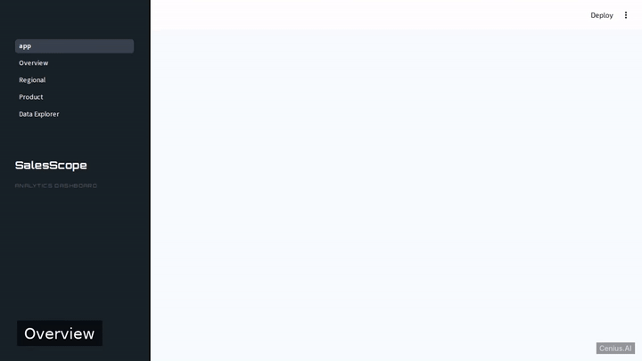
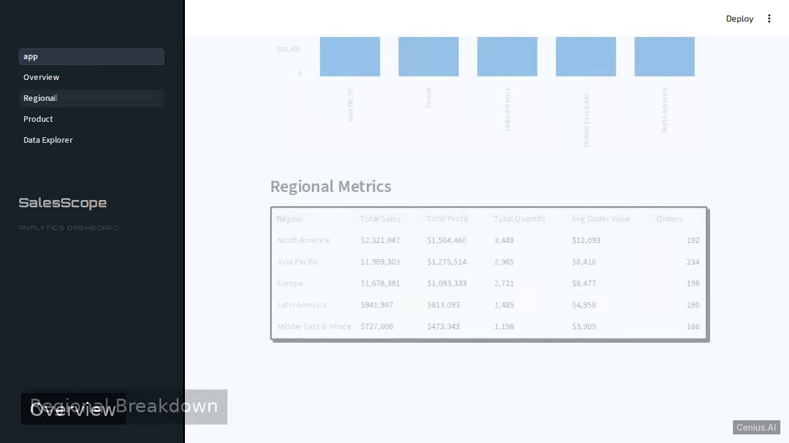
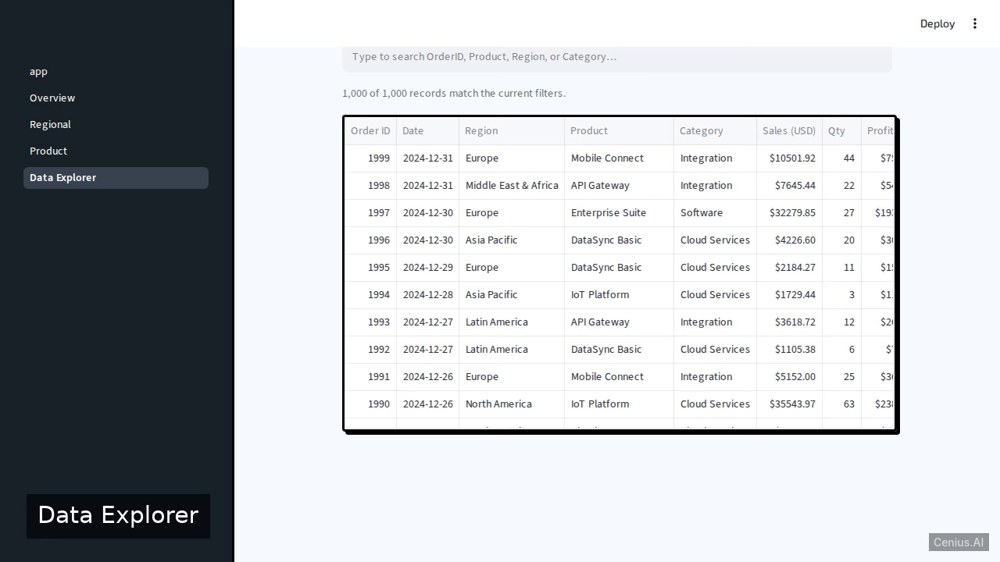

# SalesScope — complete Full-stack app monitoring dashboard example app

A Full-stack app monitoring dashboard, open-source and ready to self-host: that's **SalesScope**. Build SalesScope, a sales analytics dashboard using Python Streamlit. SalesScope ships complete — source, design assets, seed data — under the Apache-2.0 license; no cloud account needed. [Remix SalesScope on cenius.ai](https://cenius.ai/marketplace/p/salesscope-2?ref=gh&utm_campaign=salesscope-webapp-2) for a custom build.


[](LICENSE)  [](https://cenius.ai)

[](https://cenius.ai/marketplace/p/salesscope-2?ref=gh&utm_campaign=salesscope-webapp-2)

> **▶ [Open & edit in cenius.ai](https://cenius.ai/marketplace/p/salesscope-2?ref=gh&utm_campaign=salesscope-webapp-2)** — one click to an editable workspace: describe changes in plain English, get an instant preview, one-click deploy and host. Modifications made on the platform come with full rebrand & relicense rights.

_Local clone? See [Quick start](#quick-start) below. cenius.ai is the zero-setup path._

## Demo



▶ **[Full demo walkthrough](https://cenius.ai/marketplace/p/salesscope-2?ref=gh&utm_campaign=salesscope-webapp-2)** — watch it on the project page · [download MP4](.github/media/demo.mp4)

## Screenshots

  

## Architecture

Open the repo and you'll find a complete Full-stack app application (28 files). Top-level layout: `data/`, `pages/`. Installation walkthrough: [`INSTALL.md`](INSTALL.md).

## Features

- Overview Page with KPIs and Charts
- Regional Breakdown Page
- Product Performance Page
- Data Explorer with Filters
- Sample Data Loader

## Quick start

See [`INSTALL.md`](INSTALL.md) for full setup and usage instructions.

## Usage guide

### 1. Start the Dashboard

After installation, launch the application:

```bash
streamlit run app.py
```

Open your browser at [http://localhost:8501](http://localhost:8501).

### 2. Navigation

Use the sidebar to switch between pages:

#### Overview (`pages/1_Overview.py`)
Displays key performance indicators (total revenue, profit, number of orders) and summary charts.

#### Regional (`pages/2_Regional.py`)
Breaks down sales by region (North America, Europe, Asia Pacific, Latin America, Middle East & Africa).

#### Product (`pages/3_Product.py`)
Shows performance per product across categories (Software, Cloud Services, Analytics, Security, Integration).

#### Data Explorer (`pages/4_Data_Explorer.py`)
An interactive table with filters to explore the raw sales dataset.

### 3. Regenerate Data

To create a fresh dataset, run:

```bash
python generate_data.py
```

This overwrites `data/sales_data.csv`. The dashboard will automatically use the new data on the next page load.

_Full guide: [`USAGE.md`](USAGE.md)_

## FAQ

### How do I get SalesScope running locally?

Pull the repo, run `./install.sh`, and you are up — the script installs packages and pre-seeds the database. [`INSTALL.md`](INSTALL.md) covers any platform-specific tweaks.

### Is SalesScope free for commercial use?

It is. Apache-2.0 licensing means you can build a product on it, sell it, or use it inside a company with no fees. Details: [LICENSE](LICENSE).

### Is SalesScope editable without a developer?

Describe what you want changed on [cenius.ai](https://cenius.ai/marketplace/p/salesscope-2?ref=gh&utm_campaign=salesscope-webapp-2) — no code editing needed; the platform produces a fresh build you can download and deploy.

### What is SalesScope built with?

Powered by Full-stack app. This repo is the real thing — full source, seed data, and all — ready to clone and start up. Highlights include overview Page with KPIs and Charts.

### Is white-labeling SalesScope allowed?

Yes — and the easiest way is [remixing it on cenius.ai](https://cenius.ai/marketplace/p/salesscope-2?ref=gh&utm_campaign=salesscope-webapp-2): modifications made on the platform come with full rebrand and relicense rights over your derivative.

## License & rebranding

Released under the [Apache License 2.0](LICENSE) (© 2026 Cenius AI) — free for personal and commercial use. The Cenius name/logo are trademarks (see NOTICE).

**Need a customized version?** [Remix this app on cenius.ai](https://cenius.ai/marketplace/p/salesscope-2?ref=gh&utm_campaign=salesscope-webapp-2) — modifications made on the platform come with **full rebrand & relicense rights** over your derivative.

## Built with cenius.ai

This entire application — code, design, seeded demo data — was generated on **[cenius.ai](https://cenius.ai)** from a plain-English description.

- 🚀 [Build your own app on cenius.ai](https://cenius.ai)
- 🎛️ [Remix SalesScope on the marketplace](https://cenius.ai/marketplace/p/salesscope-2?ref=gh&utm_campaign=salesscope-webapp-2) — open it in a workspace, prompt for changes, and ship your own version.

More open-source apps: [the Cenius-ai catalog](https://github.com/Cenius-ai) · [showcase index](https://github.com/Cenius-ai/showcase)
